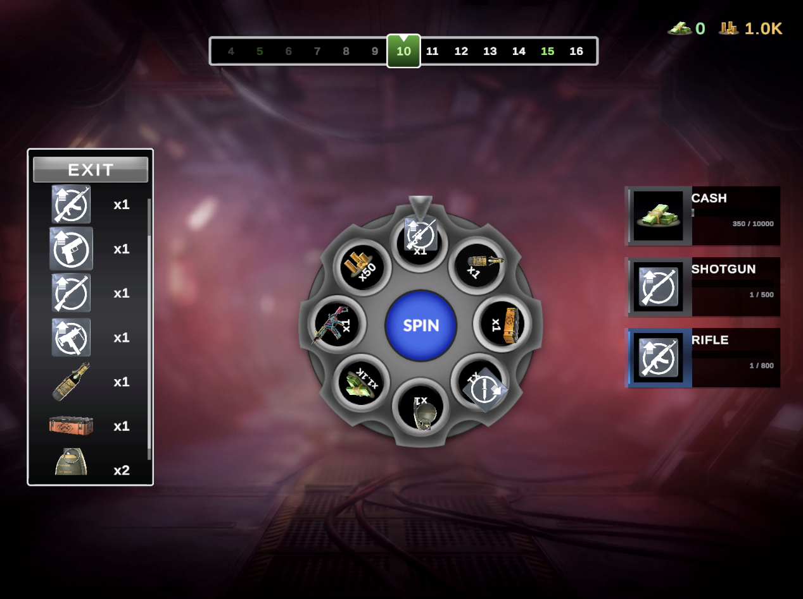

# 🎀 Spin sweet · cash out smart · don't get blown up 💣

###### a *Vertigo Wheel of Fortune* case study · Unity 2021.3.45f2

> All glitter, all guns, one bad spin away from boom. Tap to spin, hoard your loot, exit before a bomb crashes the party. 💥


---

## 🌸 How to Play

| Action | What happens |
|---|---|
| Tap **SPIN** | The wheel turns, a reward lands in your *pending* stash |
| Tap **EXIT** | Pending rewards move into your inventory forever ✨ |
| Every **5th** spin | **Safe** zone, no bombs, just breathe |
| Every **30th** spin | **Super** zone, the fancy stuff lives here |
| Normal zones | A bomb might land. If it does, your run ends 💀 |
| Revive | Pay gold to keep your loot. Each revive costs more |
| Persistence | Banked rewards survive between sessions (PlayerPrefs) |

---

## 🌼 How to Run

1. 💝 Open the project in **Unity 2021.3.45f2 LTS**
2. 🔧 Run `Vertigo → Build → Full Rebuild` once after a fresh checkout
3. 🎬 Open `Assets/Scenes/SampleScene.unity` and press **Play** ▶️

---

## ✨ Highlights

The bits I'm a little proud of:

- 🧪 **Testable wheel logic**: `WheelLogic` is pure C#, no MonoBehaviour, runs without a scene
- 🎭 **Clean state machine**: `Ready → Turning → Landing → Reward → Death`, each state owns its own transitions
- 🍓 **ScriptableObject-driven content**: all wheel, zone & reward data lives under `Assets/Configs/`
- 🎀 **One-button rebuild**: `Vertigo → Build → Full Rebuild` reconstructs scene + UI from scratch
- 🎯 **Reward sampler with quotas**: per-category limits + a small dedupe so the same icon never sits next to itself
- 🪖 **Object pooling**: reward icons & list rows, no GC hiccups during spins

---

## ⚔️ Architecture

### System overview

```text
┌──────────────────────────────────────────────────────────┐
│  WheelLogic   (pure C#, no MonoBehaviour)                │
│  Spin(zone) → SpinResult                                 │
└────────────────────────┬─────────────────────────────────┘
                         │  called by
                         ▼
┌──────────────────────────────────────────────────────────┐
│  WheelController   (event bridge: logic ↔ UI)            │
└────────────────────────┬─────────────────────────────────┘
                         │  emits
     ┌───────────────────┼───────────────────┐
     ▼                   ▼                   ▼
 OnZoneChanged     OnRewardEarned       OnDeathHit
 OnRewardsBanked   OnRevived            OnRunEnded
     │                   │                   │
     └───────────────────┼───────────────────┘
                         │  subscribed by
                         ▼
┌──────────────────────────────────────────────────────────┐
│  Presentation Layer                                      │
│    ├─ UI Panels                                          │
│    │     HUD · popups · reward list · MetaProgress       │
│    ├─ ExitFlow / DeathFlow                               │
│    │     RunExitController · revive · bank rewards       │
│    └─ MetaProgressionService                             │
│          per-run weapon points                           │
└──────────────────────────────────────────────────────────┘

┌──────────────────────────────────────────────────────────┐
│  Persistence                                             │
│    PlayerProgress  →  PlayerPrefs                        │
│      ├─ writes  · bank · revive · app pause · quit       │
│      └─ reads   · Start                                  │
└──────────────────────────────────────────────────────────┘

┌──────────────────────────────────────────────────────────┐
│  Rebuild Pipeline                                        │
│    Vertigo → Build → Full Rebuild                        │
│      ├─ WheelDistributionApplier.Apply()                 │
│      └─ WheelSceneSetup.Build()                          │
└──────────────────────────────────────────────────────────┘
```

Spin states live in `Assets/Scripts/Wheel/Controller/`: `ReadyState`, `TurningState`, `LandingState`, `RewardState`, `DeathState`, `PostReviveReadyState`. They all derive from `WheelStateBase`. States never call each other directly; only `WheelController` performs transitions.

### What happens when you press SPIN 🎡

1. 🎀 Spin button → `WheelController.RequestSpin()`
2. 🎲 `WheelLogic.Spin(zone)` produces a `SpinResult` (which slice, how much, is it a bomb?)
3. 🌀 The wheel turns via `WheelView.SpinTo(...)` using PrimeTween
4. 🎁 On stop, the reward is added to `RewardInventory` as *pending*. If it's a bomb 💥, we transition into the Death state
5. 💰 Tap **EXIT** and pending rewards move into the banked inventory

### Logic ↔ UI

`WheelLogic` is pure C#, no MonoBehaviour, runs without a scene. The UI side never touches it directly; it subscribes to `WheelController` events:
`OnZoneChanged`, `OnRewardEarned`, `OnDeathHit`, `OnRewardsBanked`, `OnRevived`, `OnRunEnded`.

### ExitFlow 🚪

`RunExitController` orchestrates the exit and death panels (`ExitFlowState`). In the EXIT flow, pending rewards move into the inventory. In the death flow, the revive button calls `WheelController.TryRevive()`. Revive cost grows each time: `reviveCurrencyCost * (1 + revive_count)`.

### MetaProgress 🔫

`MetaProgressionService` tracks weapon points earned during the run and reflects them on the MetaProgress panel. Resets when the run ends.

### Persistence 💾

`PlayerProgress` stores cash, gold, and banked rewards in PlayerPrefs. Writes happen on bank, revive, app pause, and quit. Reads happen once on `Start`.

### Full Rebuild 🔧

`Vertigo → Build → Full Rebuild` does two things:
- `WheelDistributionApplier.Apply()` re-applies slice distributions to zones from config
- `WheelSceneSetup.Build()` rebuilds the scene's Canvas, wheel, and UI hierarchy from scratch

Run it once after a fresh checkout and you're good to go ✨

---

## 🍓 Project Structure

```
Assets/
  Scripts/
    Core/                  · ObjectPool, GameRules, formatters
    Wheel/
      Controller/          · WheelController + state machine
      Logic/               · WheelLogic + reward sampler (no MonoBehaviour)
      View/                · WheelView, SliceView, spin animator
      Config/              · ScriptableObject configs
      Rewards/             · RewardInventory, currency, formatter
      UI/                  · HUD, popups, reward list, MetaProgress
      ExitFlow/            · RunExitController, exit pill, revive
      MetaProgress/        · per-run weapon point progression
      Persistence/         · PlayerProgress (PlayerPrefs)
  Editor/
    Builders/              · scene + UI builders, validation audits
    Layout/                · UILayoutBuilder + layout passes
    Drawers/               · custom inspectors
  Configs/                 · SO assets (Zones, Rewards, MetaProgress, ...)
  Atlases/                 · Sprite Atlas files
  Scenes/SampleScene.unity · entry scene
```

---

## 🎨 Tech & Tools

- 🦋 **PrimeTween** for UI animations (panels, scale punches, wheel rotation)
- 💫 One custom particle effect for the reward-fly burst that lands on the side panel
- 📦 Sprite Atlas split into **6 categories** (Icon, Spin, Button, Panel, Frame, VFX)
- 💌 **TextMeshPro** on every label
- 📐 Canvas Scaler `ScaleWithScreenSize`, reference **1920×1080**, *Expand* mode

---

## ⚡ Performance Notes

The hot path is the spin loop. Every choice below is there to keep it allocation-free, draw-call-light, and free of mid-spin frame spikes.

**Allocation discipline**
- `WheelLogic` runs as pure C# with no `MonoBehaviour`, no `transform` access, no `Resources.Load`. The spin pipeline returns a `SpinResult` value type. No reflection at runtime.
- ScriptableObjects under `Assets/Configs/` hold all wheel, zone and reward content. Data is referenced, not parsed, at runtime. No JSON, no `Resources.Load`, no PlayerPrefs reads inside the spin loop.
- Reward icons and reward list rows pooled through `ObjectPool`. Zero `Instantiate` or `Destroy` during a run.
- PrimeTween for every UI tween. Struct based, no per tween heap allocations, no coroutine churn.

**Render cost**
- Sprite Atlas split into 6 buckets (Icon, Spin, Button, Panel, Frame, VFX) so the wheel, side panels and HUD batch within a single draw call group each.
- Decorative graphics ship with `raycastTarget` and `maskable` off. An editor audit enforces this across the scene so `GraphicRaycaster` only walks interactive nodes.
- Single Canvas Scaler (`ScaleWithScreenSize`, 1920×1080, Expand). One layout serves 20:9, 16:9 and 4:3 without per aspect prefab forks. Canvas rebuilds are avoided by isolating dynamic widgets (reward inventory, spin button) from static frames.
- TextMeshPro on every label. Mutable labels carry the `*_value` suffix so static text never calls `SetText` after layout.

**Build path**
- Single scene (`SampleScene.unity`). No async loads, no additive scenes.
- `Vertigo → Build → Full Rebuild` reconstructs the UI from configs at edit time. Nothing rebuilds itself at runtime.

---

## 💎 Engineering Decisions

The interesting trade-offs, and *why*:

### 🩹 Revive uses a one-shot logic flag, not a pool-level slot skip
After paying gold to revive, the next spin gets one bomb-free guarantee via `forceNoBombNextSpin` on `WheelLogic`. If RNG lands on the bomb slot, we redirect to a neighbouring slice. The bomb slice is still visually on the wheel for that one spin.
**Why:** a pool-level skip would have meant rebuilding the slice list mid-flow. The logic-level guard was the smaller, safer change. The flag clears itself after a single spin so subsequent zones behave normally.

### 🦋 PrimeTween instead of a custom tween system
The only custom animation code is the reward-fly burst, a small particle effect.
**Why:** wheel cases aren't the place to reinvent a tween library.

### 🍓 MetaProgress rows aren't pooled
They're built once when the panel opens.
**Why:** there are only a handful of them; pooling would add complexity without a real win.

### 📲 No SafeArea handling
**Why:** the brief targets landscape only, and Canvas Scaler Expand covers the listed aspect ratios.

### 💾 PlayerPrefs for persistence
**Why:** enough for what the brief asks. A proper save file would be future work.

### ⏰ A small note on timing
I submitted slightly later than planned because I refactored the UI from a mostly code-driven setup into a more standard prefab-based structure late in development. The current shape is much closer to how production UI is usually authored, and I think the result justifies the slip.

---

## 📸 Screenshots

All screenshots live under `Docs/Screenshots/`.

### 🎯 20:9 · main aspect


### 💀 16:9 · death & revive


### 🔫 4:3 · full UI with inventory & MetaProgress


---

## 🚀 Build / Release

### 🪖 Android APK
- `Tools → Build → Android APK` or `Tools → Build → Android APK + Run`
- Bundle id: `com.simay.vertigowheel`
- AndroidMinSdkVersion: 22
- Output: `Build/VertigoWheel.apk`

### 📦 GitHub Release
The APK is shared via a GitHub Release rather than committed to the repo.

### 📲 APK Download
[**Download APK ✨**](https://drive.google.com/file/d/1VxuD5v-L_xG7tuDoB4XAF-BY3kkhfsjW/view?usp=sharing)
